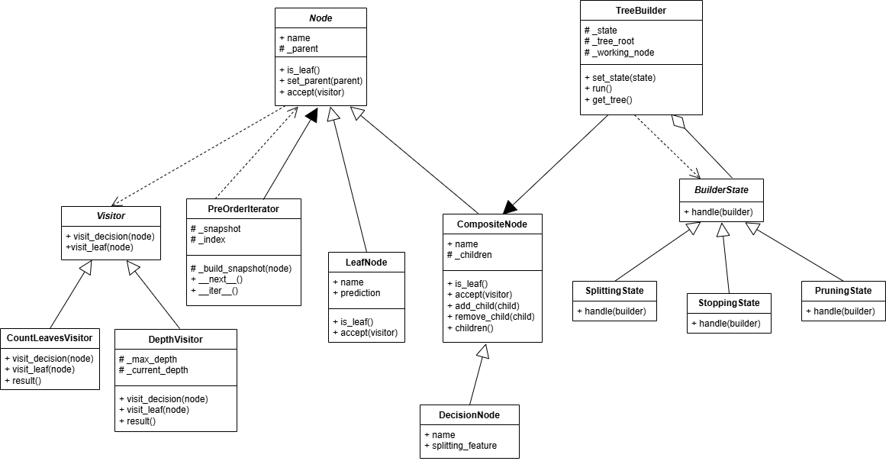

# Projeto Individual de Modelagem – Árvore de Decisão (Mock)

Este projeto apresenta a modelagem de uma árvore de decisão simplificada, utilizando quatro padrões de projeto fundamentais:

- Composite
- Iterator
- Visitor
- State

Todo o comportamento é mockado, sem execução de algoritmos reais — apenas prints que representam operações e transições.

## Diagrama de Classes (UML)

Abaixo, a representação visual da arquitetura do projeto, detalhando as relações entre os padrões aplicados:



-----

### Composite

O padrão **Composite** permite estruturar objetos em hierarquias do tipo árvore, onde elementos individuais e composições são tratados da mesma maneira.

No projeto, esse padrão modela a própria árvore de decisão:

- `Node` é o componente base.
- `DecisionNode` representa nós internos que possuem filhos (Composite).
- `LeafNode` representa folhas, sem filhos (Leaf).

Com isso, o código trata `DecisionNode` e `LeafNode` de forma uniforme, permitindo chamadas como `node.accept(visitor)` independentemente do tipo do nó. Esse padrão é ideal para estruturas hierárquicas como árvores de decisão.

-----

### Iterator

O padrão **Iterator** possibilita percorrer uma estrutura de dados sem expor sua implementação interna.  
Na árvore de decisão, o Iterator controla como os nós são visitados:

- `PreOrderIterator` percorre a árvore em pré-ordem.
- `BFSIterator` percorre a árvore em largura, visitando primeiro todos os nós de um nível antes de avançar para o próximo.

O uso de iteradores permite navegar pela árvore de forma independente da lógica do nó, mantendo o design desacoplado e flexível.

-----

### State

O padrão **State** viabiliza que um objeto altere seu comportamento conforme seu estado interno muda.

No projeto, ele modela o processo de construção da árvore:

- `TreeBuilder` é o contexto.
- Estados como `SplittingState`, `StoppingState` e `PruningState` representam fases da construção.

Cada estado define um comportamento diferente, e o `TreeBuilder` muda de estado conforme a construção avança.  
Isso simula as fases típicas de uma árvore de decisão real.

-----

### Visitor

O padrão **Visitor** concede a capacidade de separar operações aplicadas à estrutura sem precisar modificar as classes da árvore.

Nesta modelagem, a aplicação do padrão inclui:

- `Visitor` é a interface base.
- `CountLeavesVisitor` conta folhas.
- `DepthVisitor` calcula a profundidade.

Cada visitante implementa um comportamento diferente e é aplicado aos nós via `accept(visitor)`.  
Isso permite a adição de novas operações à árvore sem alterar as classes `Node`, `DecisionNode` ou `LeafNode`.


## Estrutura do Projeto

/

├── tree_design.py # Implementação dos padrões (Composite, Iterator, Visitor, State)

├── tree_demo.py # Código de demonstração

└── class_diagram.png # Diagrama UML


## Como executar

1. Certifique-se de estar no diretório do projeto.
2. Execute o script de demonstração:

```bash
python tree_demo.py
```

Isso executa:

- a construção mockada da árvore;
- o percurso em pré-ordem;
- a aplicação dos visitantes (profundidade e contagem de folhas);
- a simulação da construção via estados.
